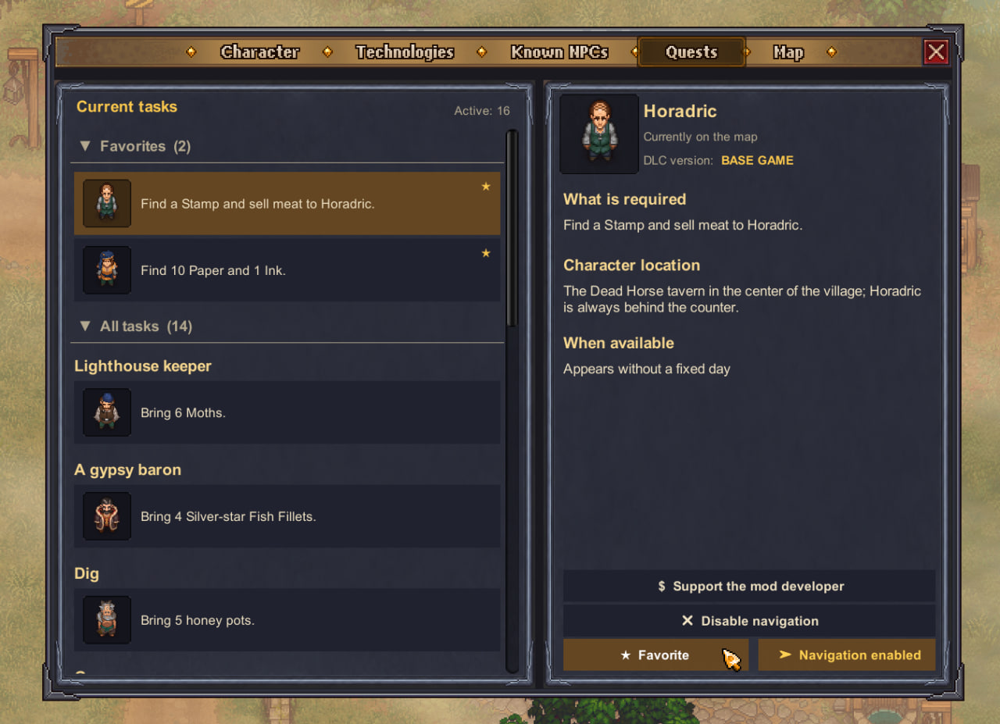
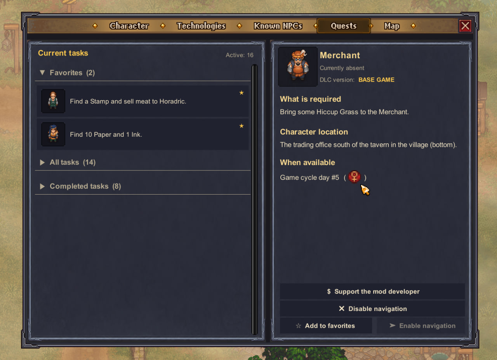
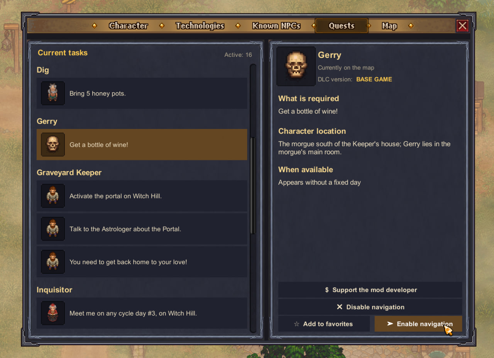
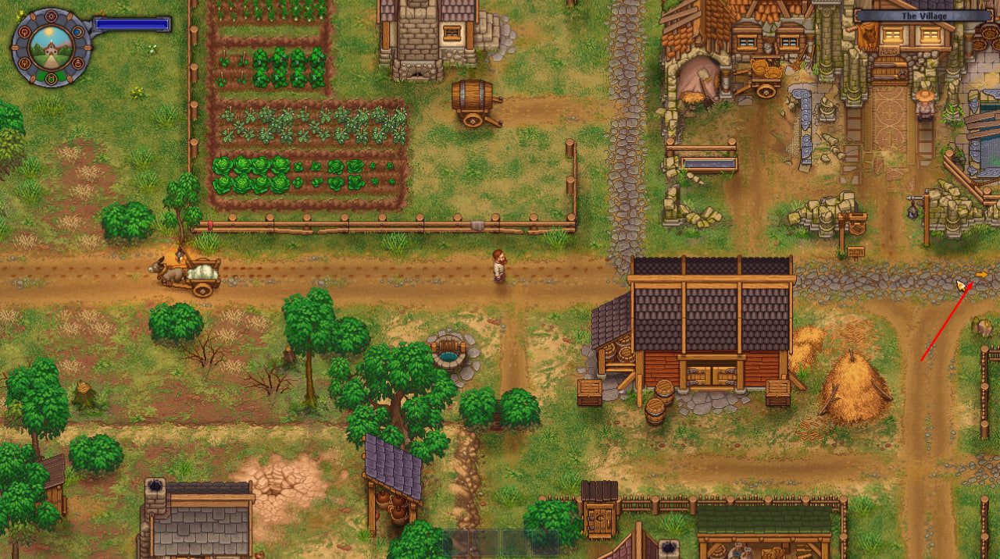
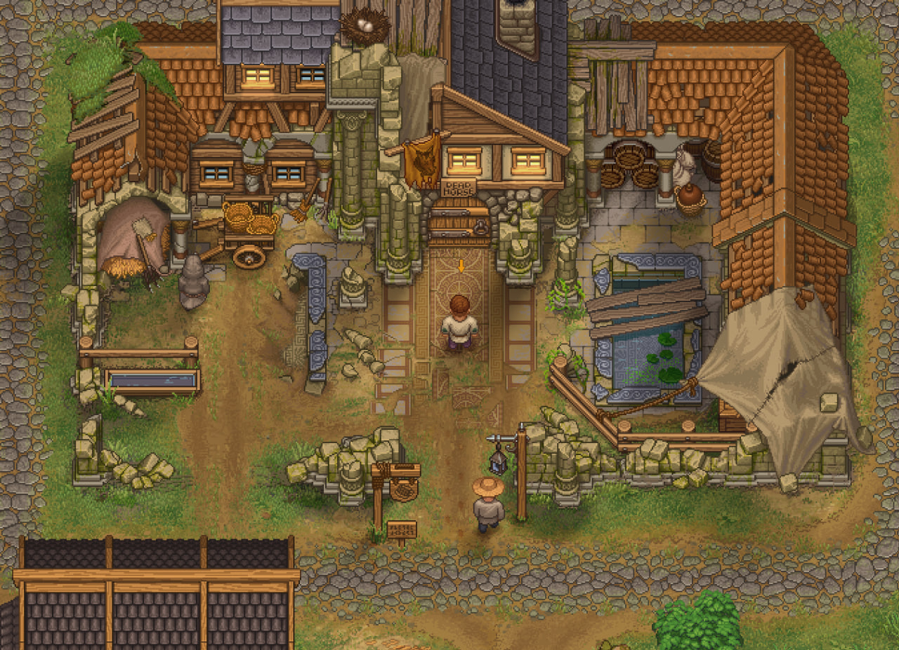
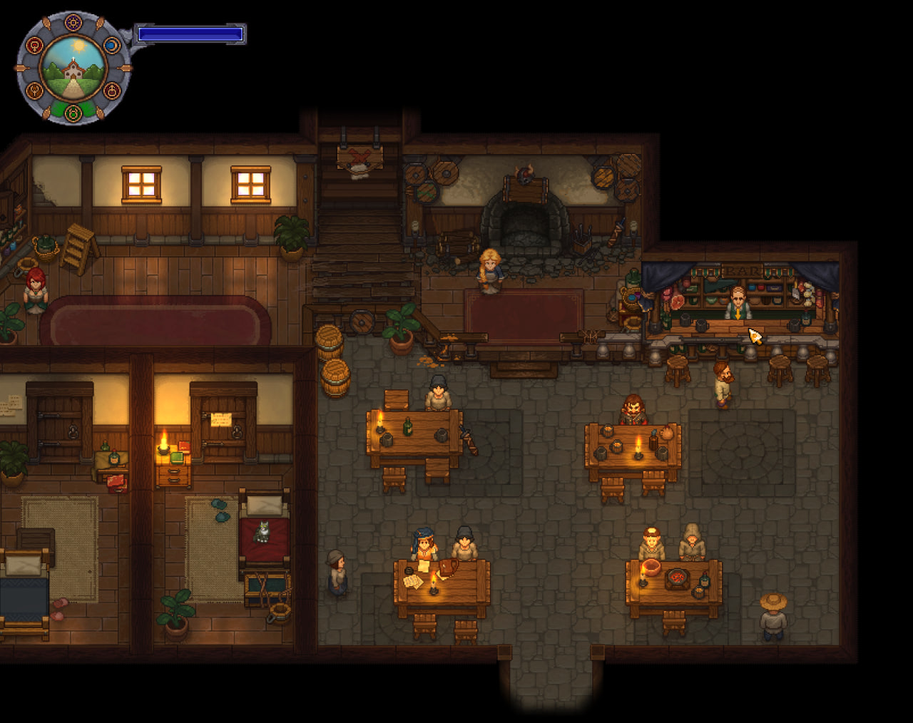
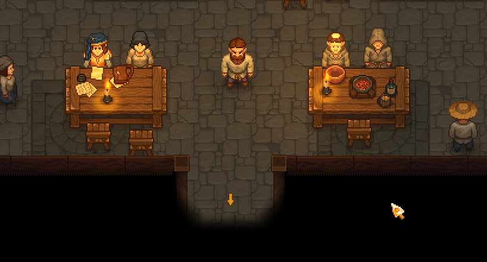

<div align="center">

# Vanilla Quest Journal

**A native-style quest journal for Graveyard Keeper.**<br>
Keep every active and completed task organized, find the character you need, and spend less time searching through dialogue history.


</div>

## Features

- **Fits the vanilla interface.** The journal is added as a native game-menu tab and follows Graveyard Keeper's visual style instead of drawing a separate HUD or overlay.
- **Organized by character.** Tasks are grouped under the character who gave them, while every task remains a separate selectable entry.
- **Three collapsible sections:**
  - **Favorites** — tasks you want to keep close at hand.
  - **All tasks** — every currently active task, grouped by character.
  - **Completed tasks** — finished tasks read directly from the game state.
- **Useful details for every task and character:**
  - character name and portrait;
  - full task objective;
  - whether the character is currently present on the map;
  - character location;
  - appearance schedule and day icon, when applicable;
  - base-game or DLC origin.
- **Favorites.** Mark any active task as a favorite and return to it immediately. Favorites preserve their insertion order and are stored in the mod configuration, independently from game saves.
- **Character navigation.** Enable navigation for a task to receive an on-screen direction marker. The mod points directly to a reachable character or chooses the appropriate shortest route through entrances and transitions when the character is in another location.
- **Route updates.** Navigation refreshes after dialogue, scene transitions, teleports, and meaningful player movement.
- **Completed-task history.** Review tasks the game already marks as completed without modifying the save file.
- **Save-safe design.** The mod only reads quest data from the game; it does not create an alternative quest system or write custom data into saves.
- **Quick access.** Press `F6` while playing to open the journal tab.

## Languages

**The journal interface supports every language available in Graveyard Keeper.** It automatically follows the language selected in the game settings.

| | | |
|:---:|:---:|:---:|
| English | Deutsch | Français |
| Español | Português do Brasil | Русский |
| Italiano | Polski | 日本語 |
| 简体中文 | 한국어 | |

Character-location descriptions are currently available in English and Russian. Other languages use the English descriptions as a fallback, while the rest of the journal interface remains fully translated.

## Screenshots

<p align="center">
  
  <br>
  <sub>The journal overview, favorites, task details, and navigation controls.</sub>
</p>

<table>
  <tr>
    <td align="center" width="50%">
      <br>
      <sub>Collapsible task sections and character schedules.</sub>
    </td>
    <td align="center" width="50%">
      <br>
      <sub>Separate tasks grouped by character.</sub>
    </td>
  </tr>
  <tr>
    <td align="center">
      <br>
      <sub>Navigation selects the correct route across the world.</sub>
    </td>
    <td align="center">
      <br>
      <sub>The marker leads to the appropriate entrance.</sub>
    </td>
  </tr>
  <tr>
    <td align="center">
      <br>
      <sub>After a transition, the route continues inside the destination.</sub>
    </td>
    <td align="center">
      <br>
      <sub>Direct guidance once the target is reachable.</sub>
    </td>
  </tr>
</table>

## Installation

### Requirements

- Graveyard Keeper
- BepInEx 5.4.23.5

### Installing BepInEx

1. Open the [Graveyard Keeper BepInEx 5 Pack on Nexus Mods](https://www.nexusmods.com/graveyardkeeper/mods/79?tab=files).
2. Download **BepInEx - Windows-Wine-Proton - 64-bit** from the **Files** tab.
3. Extract the downloaded archive directly into the main Graveyard Keeper folder, next to `Graveyard Keeper.exe`.
4. Start the game once, then close it. BepInEx will create its folders and configuration files.

After a successful installation, the game folder will contain `BepInEx`, `doorstop_config.ini`, and `winhttp.dll`.

### Installing Vanilla Quest Journal

1. Select **Code → Download ZIP** on this repository and extract the archive.
2. Copy the included `VanillaQuestJournal` folder into:

   ```text
   Graveyard Keeper/BepInEx/plugins/
   ```

3. Start the game. The new **Quests** tab will appear in the regular game menu.

The resulting layout should be:

```text
Graveyard Keeper/
└── BepInEx/
    └── plugins/
        └── VanillaQuestJournal/
            ├── VanillaQuestJournal.dll
            └── languages/
```

## Support the developer

If Vanilla Quest Journal made your time in Graveyard Keeper a little more pleasant, you can support its continued development here:

<p align="center">
  <a href="https://ko-fi.com/ggroy12">
    
  </a>
</p>

The same support link is available from the task-details panel inside the mod. The button is entirely optional and can be hidden:

1. Press `F1` to open **BepInEx Configuration Manager**.
2. Select **Vanilla Quest Journal**.
3. Expand **Interface**.
4. Disable **Show support button**.

If Configuration Manager is not installed, close the game and edit:

```text
Graveyard Keeper/BepInEx/config/ggroy.gyk.vanillaquestjournal.cfg
```

Set the following value:

```ini
[Interface]
Show support button = false
```

## License

Vanilla Quest Journal is distributed under the [MIT License](LICENSE).
