<div align="center">

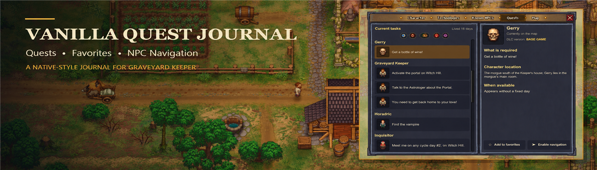

# Vanilla Quest Journal

**A quest journal that feels at home in Graveyard Keeper.**

See what each character currently needs, keep important tasks close, and find your way to the person you need to meet.


</div>

## What it does

- **Keeps tasks in one familiar place.** The Quests tab sits inside the game's regular menu. Active tasks are grouped by character, and favorites and completed tasks have their own collapsible sections.
- **Makes room for the task list.** The journal uses more of the native panel, with clearer text and rounded task cards and controls.
- **Shows the details you need.** Select a task to see its full objective, character portrait, location, availability, and whether its character is currently on the map.
- **Filters by the six game days.** Choose a day icon to see relevant tasks across all three sections; select it again to clear the filter. The header shows the current day with its game icon and can switch to the number of days lived.
- **Keeps favorites handy.** Mark active tasks as favorites; the mod remembers them in its configuration without changing your game save.
- **Guides you to characters.** Turn on navigation for a task to follow the game's animated marker toward a reachable character or an entrance leading to their location.
- **Works with keyboard and controller.** Open or close the journal with `J` by default, or change the shortcut in the mod settings. A controller can move through the journal, scroll its task list, use filters and sections, and activate its buttons.
- **Follows your game language.** The interface and character location descriptions are available in all languages supported by Graveyard Keeper.

**Customize the controls:** Press `F1` in game to open BepInEx Configuration Manager, select **Vanilla Quest Journal**, then change **Interface → Open quest journal** for the keyboard shortcut and **Controller → Favorite button / Navigation button** for the gamepad shortcuts. The defaults are `J`, `A`, and `X`, respectively.

The journal reads tasks from the game. It does not add quests or modify save files.

## Screenshots

<p align="center">
  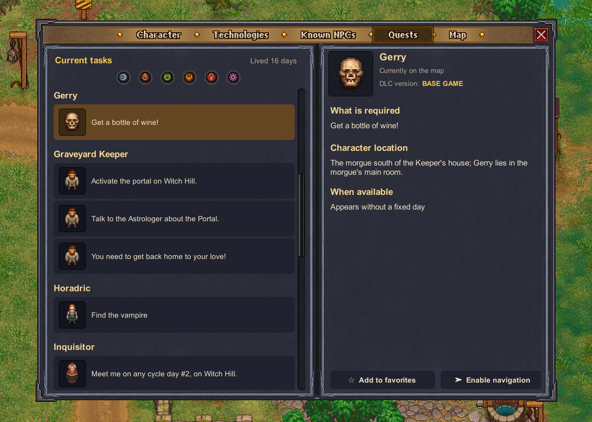<br>
  <sub>The Quests tab inside the regular game menu.</sub>
</p>

<table>
  <tr>
    <td align="center" width="50%">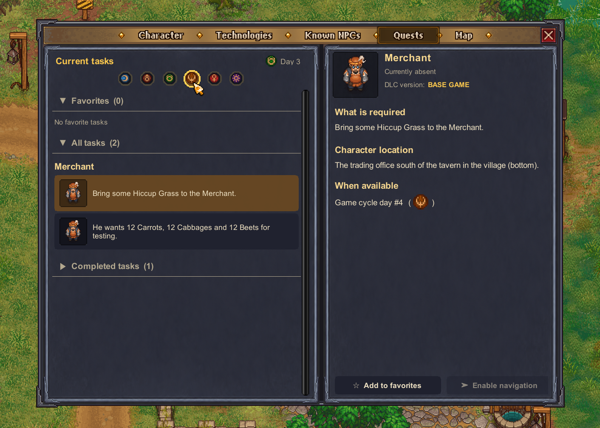<br><sub>Filter tasks by game day.</sub></td>
    <td align="center" width="50%">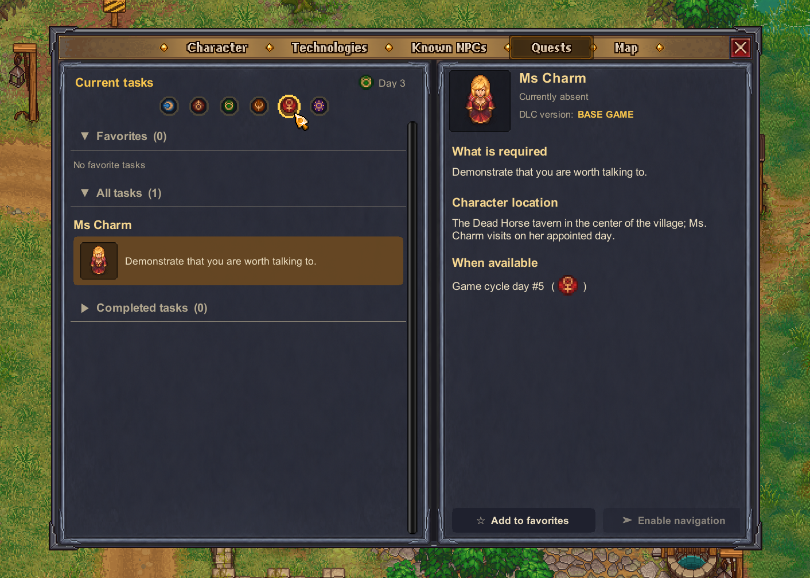<br><sub>Check when a character appears.</sub></td>
  </tr>
  <tr>
    <td align="center">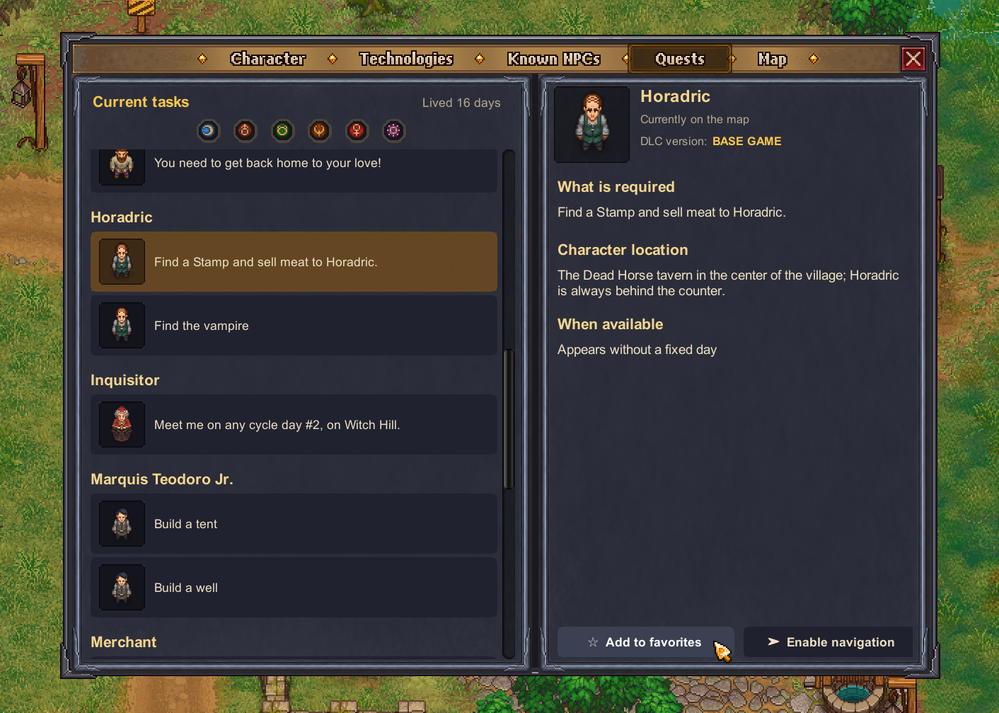<br><sub>Browse tasks grouped by character.</sub></td>
    <td align="center">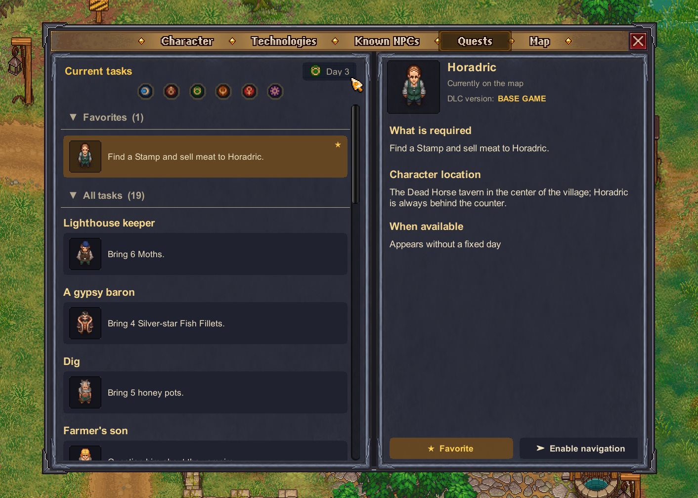<br><sub>Keep a task in Favorites.</sub></td>
  </tr>
  <tr>
    <td align="center"><br><sub>Switch the header to days lived.</sub></td>
    <td align="center">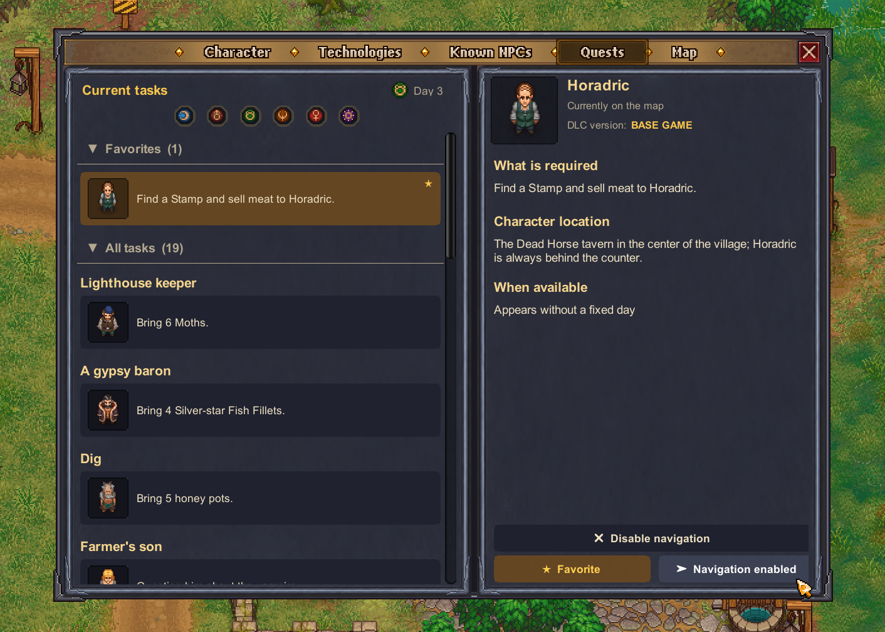<br><sub>Enable or disable character navigation.</sub></td>
  </tr>
  <tr>
    <td align="center">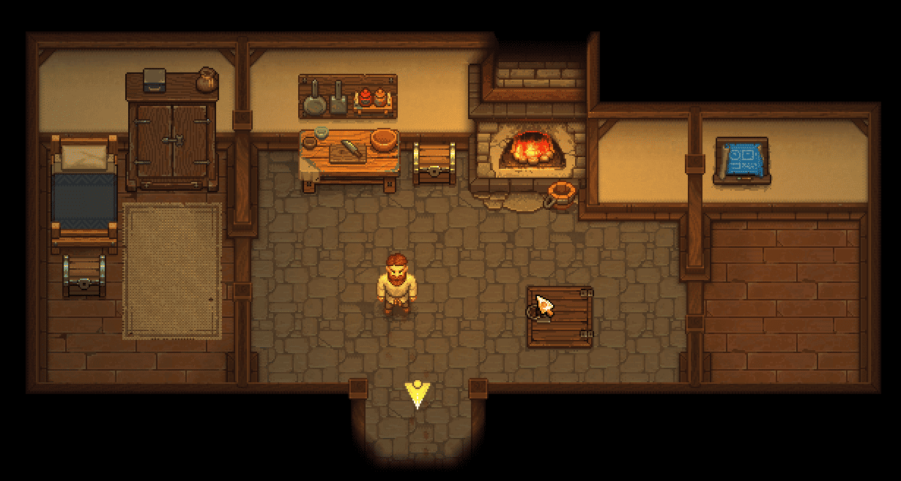<br><sub>Follow the marker to an exit.</sub></td>
    <td align="center">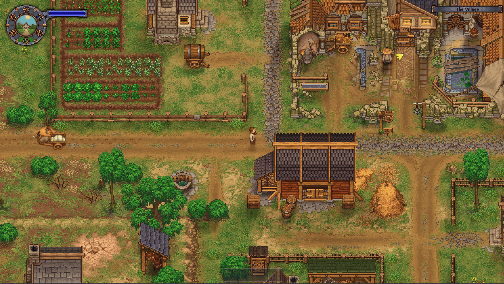<br><sub>Follow the marker outdoors.</sub></td>
  </tr>
  <tr>
    <td align="center">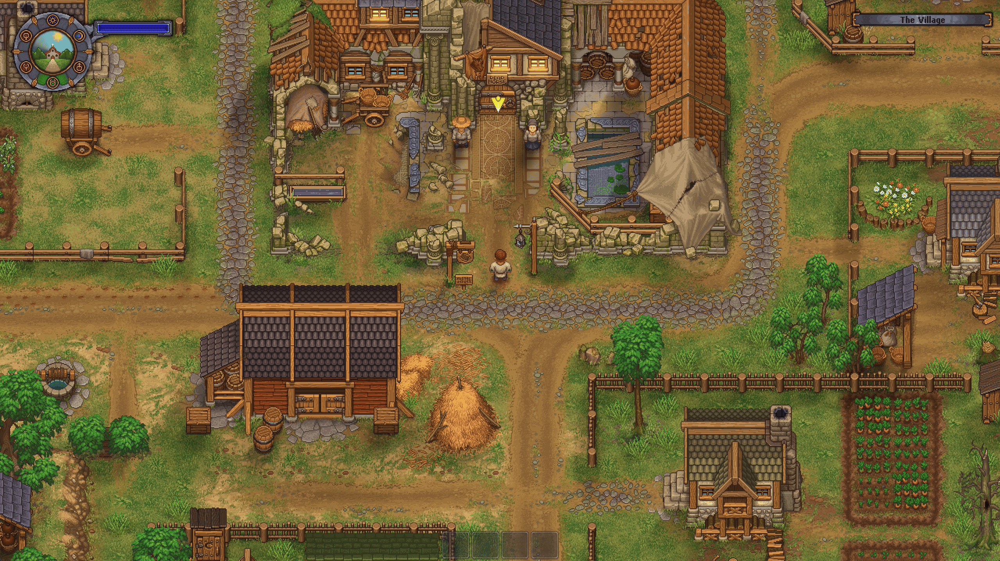<br><sub>Find the right entrance.</sub></td>
    <td align="center">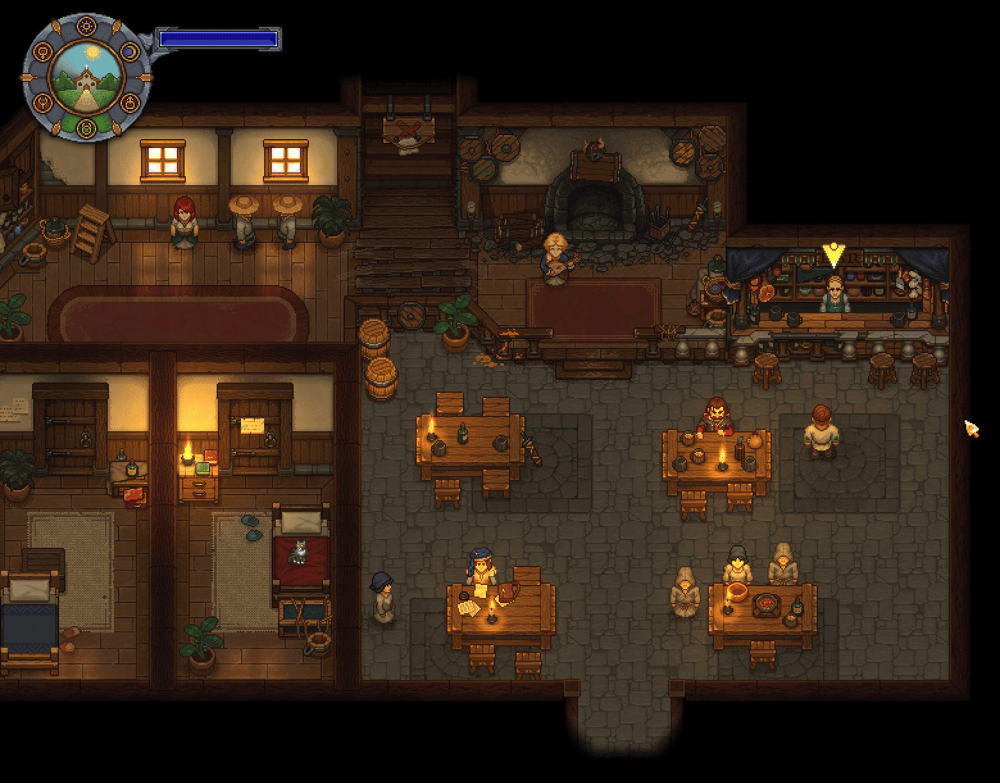<br><sub>Continue toward a character indoors.</sub></td>
  </tr>
  <tr>
    <td align="center" colspan="2">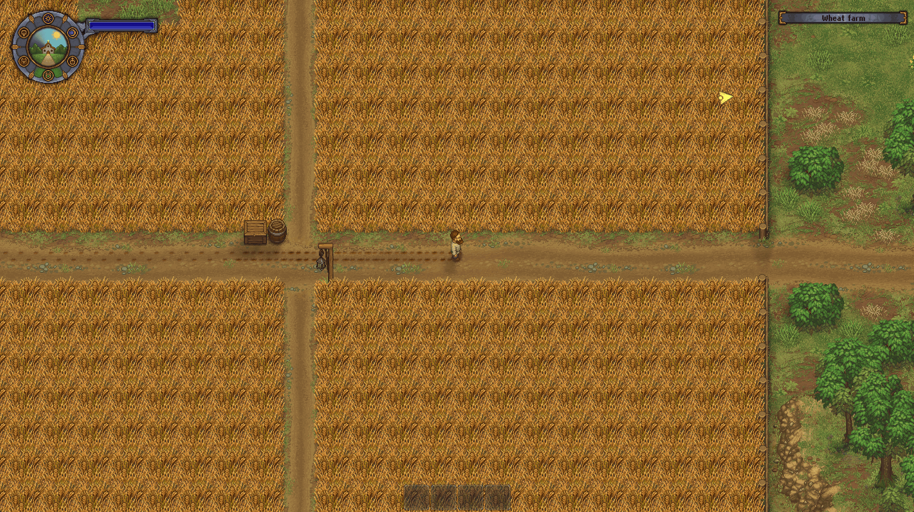<br><sub>The marker can also guide you across wider outdoor areas.</sub></td>
  </tr>
</table>

## Languages

The journal follows the language selected in the game: English, German, French, Spanish, Brazilian Portuguese, Russian, Italian, Polish, Japanese, Simplified Chinese, and Korean.

## Installation

### Requirements

- Graveyard Keeper
- [Graveyard Keeper BepInEx 5 Pack](https://www.nexusmods.com/graveyardkeeper/mods/79) (5.4.23.5)

### Install BepInEx

1. Download the **BepInEx - Windows-Wine-Proton - 64-bit** file from the pack's **Files** tab.
2. Extract it into the main Graveyard Keeper folder, next to `Graveyard Keeper.exe`.
3. Start and close the game once so BepInEx creates its folders.

### Install the journal

1. Download the latest `VanillaQuestJournal-v<version>.zip` from [Releases](https://github.com/ggroy12/vanilla-quest-journal/releases), or download this repository as a ZIP.
2. Copy the included `VanillaQuestJournal` folder into `Graveyard Keeper/BepInEx/plugins/`.
3. Start the game and open **Quests** in the regular game menu, or press `J` while playing.

Your files should look like this:

```text
Graveyard Keeper/
└── BepInEx/
    └── plugins/
        └── VanillaQuestJournal/
            ├── VanillaQuestJournal.dll
            ├── LICENSE
            └── languages/
```

## License

Vanilla Quest Journal is distributed under a [custom license](LICENSE). You may download and use it, and share unmodified copies with clear credit to **ggroy12**, a link to the [official project](https://github.com/ggroy12/vanilla-quest-journal), and a link to the [author's support page](https://ko-fi.com/ggroy12). Modifications require the author's prior written permission. See the license for the complete terms.
